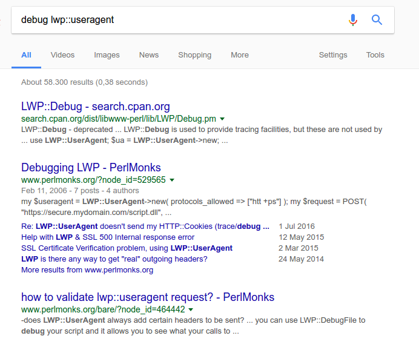
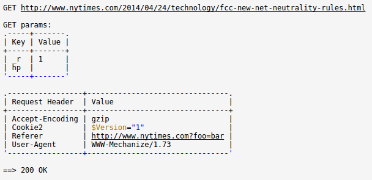
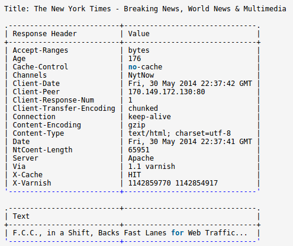

<style>
.reveal pre {
    width: 100%;
}
</style>

## Debug LWP

Debugging LWP applications all steps at the same time

Julien Fiegehenn (simbabque)
---
## LWP::UserAgent
---

- WWW::Mechanize
- Test::WWW::Mechanize
- SOAP::Lite
- SOAP::Compile::WSDL
- REST::Client
- A bunch of others

---

## not WWW::Mechanize::(?:Chrome|Firefox)
---
## often used under the hood
---
## debugging is hard
---

---
## LWP::Debug - deprecated

Only describes some debugging stuff
---
## A bunch of old posts 
---
## How to get headers?
---

## by hand

```perl
my $res = $ua->get('http://example.org');
warn $res->req->as_string;
warn $res->as_string;

```

very tedious

---

## half-automatic

```perl
$ua->add_handler("request_send",  sub { shift->dump; return });
$ua->add_handler("response_done", sub { shift->dump; return });
 
$ua->get("http://www.example.com");
```


using advice from LWP::Debug

---

<pre>
GET http://www.example.com
User-Agent: libwww-perl/6.19

(no content)
HTTP/1.1 200 OK
Cache-Control: max-age=604800
Connection: close
Date: Mon, 26 Jun 2017 11:09:04 GMT
ETag: "359670651+gzip+ident"
Server: ECS (iad/182A)
Vary: Accept-Encoding
Content-Length: 1270
Content-Type: text/html
Expires: Mon, 03 Jul 2017 11:09:04 GMT
Last-Modified: Fri, 09 Aug 2013 23:54:35 GMT
Client-Date: Mon, 26 Jun 2017 11:09:05 GMT
Client-Peer: 93.184.216.34:80
Client-Response-Num: 1
Title: Example Domain
X-Cache: HIT
X-Meta-Charset: utf-8
X-Meta-Viewport: width=device-width, initial-scale=1
</pre>

---

<pre><code class="hljs xml" style="max-height: 550px; width: 120%;">&lt;!doctype html&gt;
&lt;html&gt;
&lt;head&gt;
    <title>Example Domain</title>\n
    <meta charset="utf-8" />
    <meta http-equiv="Content-type" content="text/html; charset=utf-8" />
    <meta name="viewport" content="width=device-width, initial-scale=1" />
    &lt;style type="text/css"&gt;
    body {
        background-color: #f0f0f2;
        margin: 0;
        padding: 0;
        font-family: "Open Sans", "Helvetica Neue", Helvetica, Arial, sans-serif;
\40\40\40\40\40\40\40\40
    }
    div {
        width: 600px;
        margin: 5em auto;
 ...
(+ 758 more bytes not shown)
</code></pre>

---

## sucks if you need it a lot

---

## how do you debug stuff that's inside a Catalyst Model?

---

## So I built something

---

```perl
package Foo;
use LWP::UserAgent;
use Class::Method::Modifiers 'around';

around 'LWP::UserAgent::new' => sub {
    my $orig = shift;
    my $self = shift;

    my $ua = $self->$orig(@_);
    $ua->add_handler( request_send  => sub { shift->dump; return; } );
    $ua->add_handler( response_done => sub { shift->dump; return; } );

    return $ua;
};
```

---

## then I went on IRC #lwp

---

## LWP::ConsoleLogger

And LWP::ConsoleLogger::Easy


---

```perl
use LWP::ConsoleLogger::Easy qw( debug_ua );
use WWW::Mechanize;
 
my $mech           = WWW::Mechanize->new;   # or LWP::UserAgent->new() etc
my $console_logger = debug_ua( $mech );
$mech->get( 'https://metacpan.org' );
 
# now watch the console for debugging output
# turn off header dumps
$console_logger->dump_headers( 0 );
 
$mech->get( $some_other_url );
```

---



---




---

- indents XML
- indents JSON
- converts XML to Perl data structure
- and a ton of other things

---

## really cool

---

But still hard to use. Need to have the ua objects.


```perl
my $logger = debug_ua($ua);
```


---


---

```perl
use LWP::ConsoleLogger::Everywhere;
```

And that's it.

---

- works with all LWP::UserAgent subclasses
- deep down in your app
- load wherever you want
- as long as it's loaded at compile time it will work

---

```perl
# access all the loggers somewhere
my $loggers = LWP::ConsoleLogger::Everywhere->loggers;


# customize individually
$loggers->[0]->pretty(0);
```

---

Great for SOAP or REST clients, especially deep inside your models.

---
## Live Demo

```
use Dancer2;
use LWP::UserAgent;

get '/json' => sub {
    my $ua = LWP::UserAgent->new;
    my $res = $ua->get("http://localhost:5001/json");
    return $res->decoded_content;
};

get '/xml' => sub {
    my $ua = LWP::UserAgent->new;
    my $res = $ua->get("http://localhost:5001/xml");
    return $res->decoded_content;
};

dance;
```


---
but doesn't work with WWW::Mechanize::Chrome

---

Thank you
